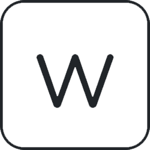

# 用戶管理系統 (gin + vue)

### 此專案主要目的為練習 前後端分離 以及使用 RESTful 風格建置API接口

### 其中Http Server會採用 Nginx
### 外網部分使用 CloudFlare Tunnel實現

## Nginx配置(vue預覽模式)
```lombok.config
location / {
    proxy_pass http://127.0.0.1:5173/;
    proxy_set_header Host $host;
    proxy_set_header X-Real-IP $remote_addr;
    proxy_set_header X-Forwarded-For $proxy_add_x_forwarded_for;
    proxy_set_header X-Forwarded-Host $http_host;
    proxy_set_header X-Forwarded-Port $server_port;
    proxy_set_header X-Forwarded-Proto $scheme;
    proxy_http_version 1.1;
    proxy_set_header Upgrade $http_upgrade;
    proxy_set_header Connection "upgrade";
    proxy_redirect http:// https://;
    # root   html;
    # index  index.html index.htm;
    # try_files $uri  /index.html;
}

location /api {
    proxy_pass http://127.0.0.1:8080;
    proxy_set_header Host $host;
    proxy_set_header X-Real-IP $remote_addr;
    proxy_set_header X-Forwarded-For $proxy_add_x_forwarded_for;
    proxy_set_header X-Forwarded-Host $http_host;
    proxy_set_header X-Forwarded-Port $server_port;
    proxy_set_header X-Forwarded-Proto $scheme;
    proxy_http_version 1.1;
    proxy_set_header Upgrade $http_upgrade;
    proxy_set_header Connection "upgrade";
    proxy_redirect http:// https://;
}
```

## Yarn
開啟預覽模式
```shell
cd pages
yarn dev
```
打包文件
```shell
cd pages
yarn build
```